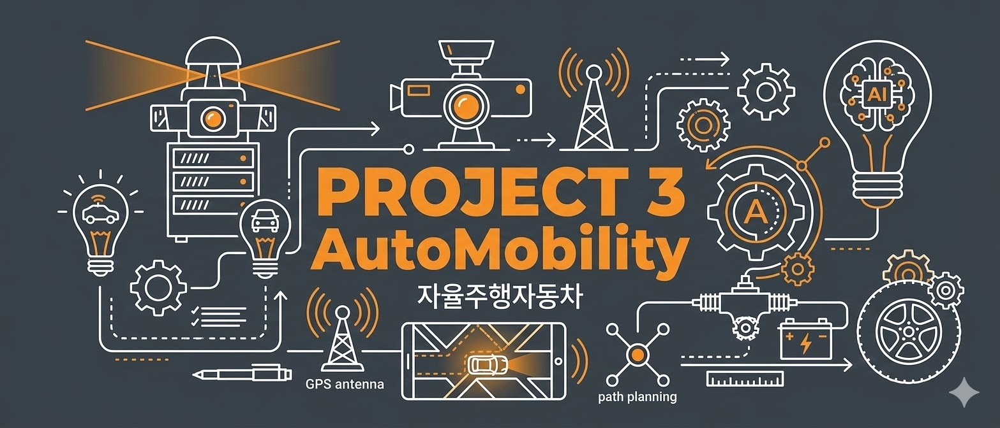
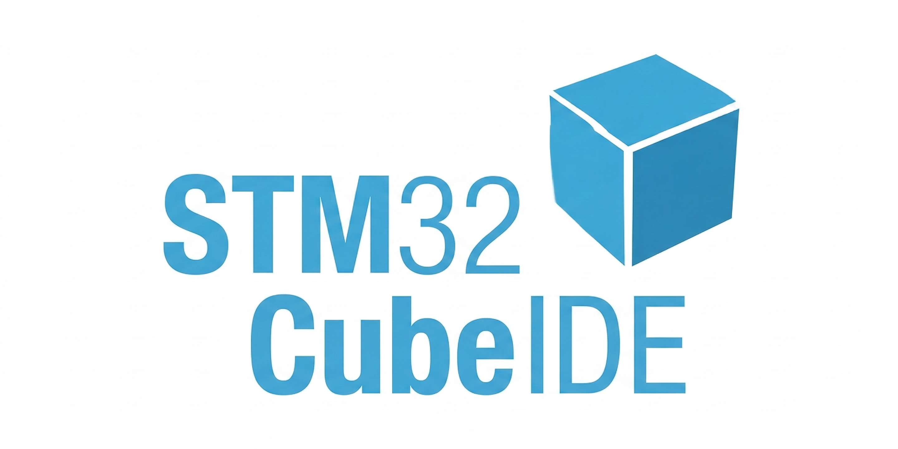
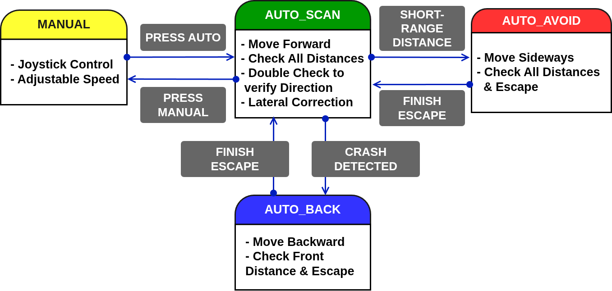
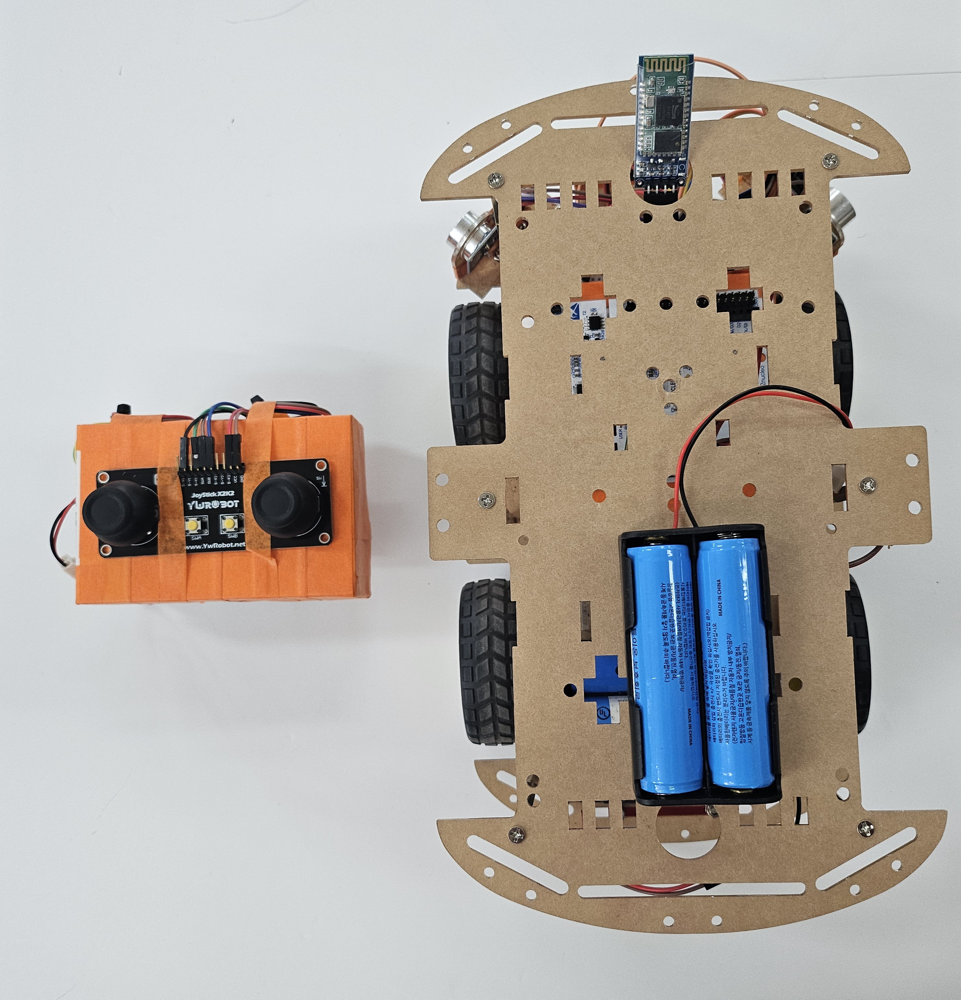
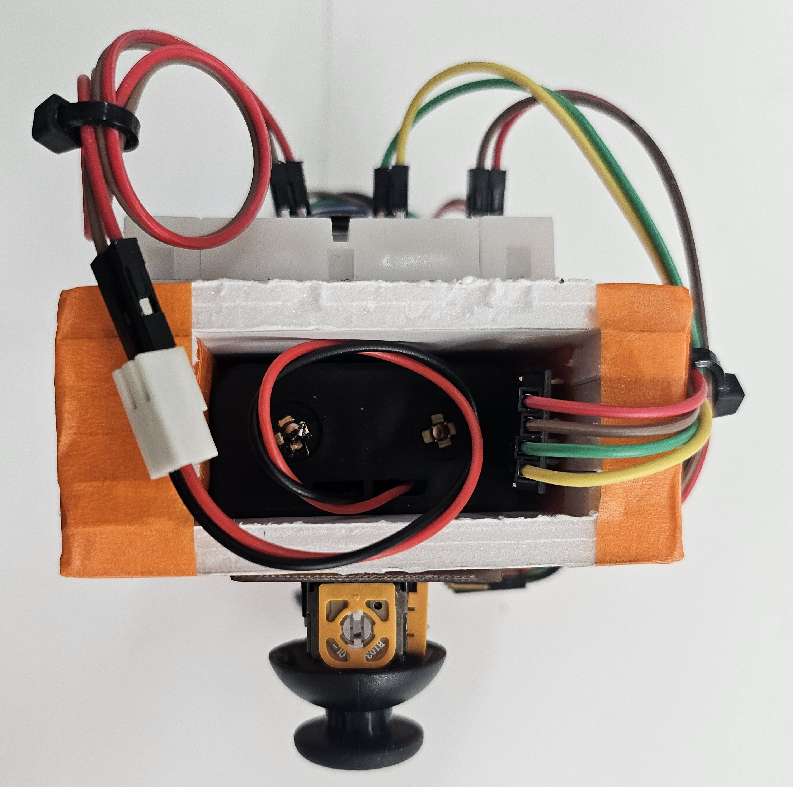
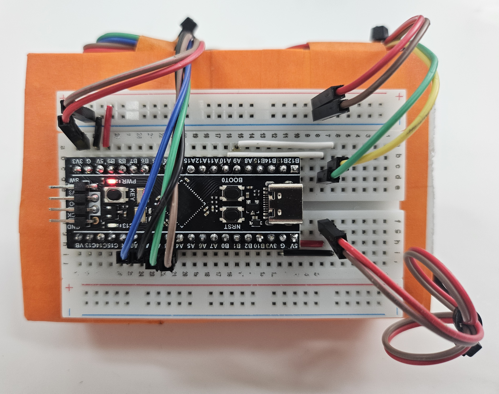
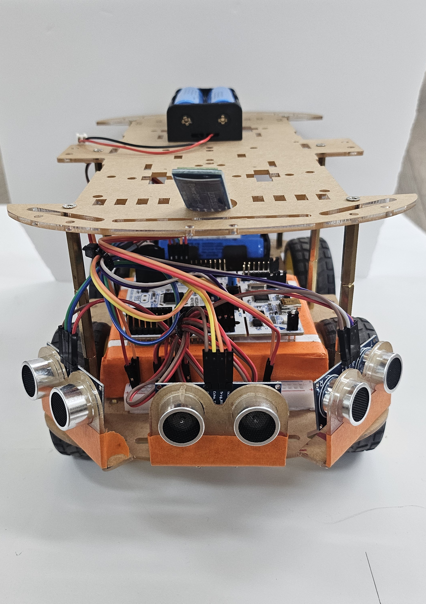
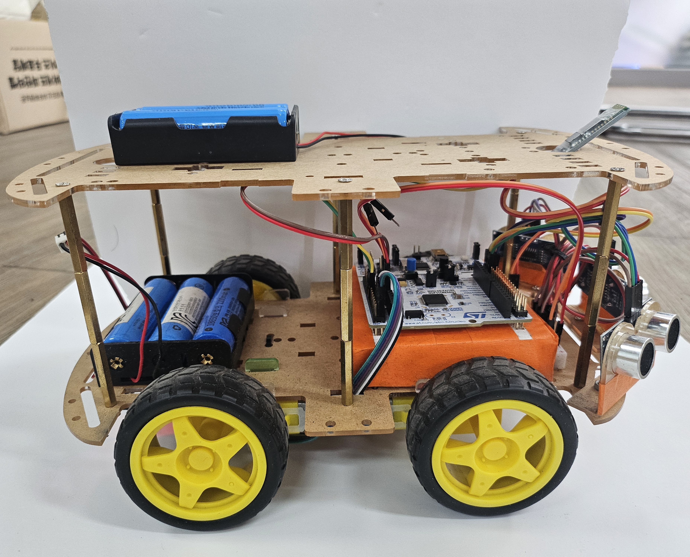
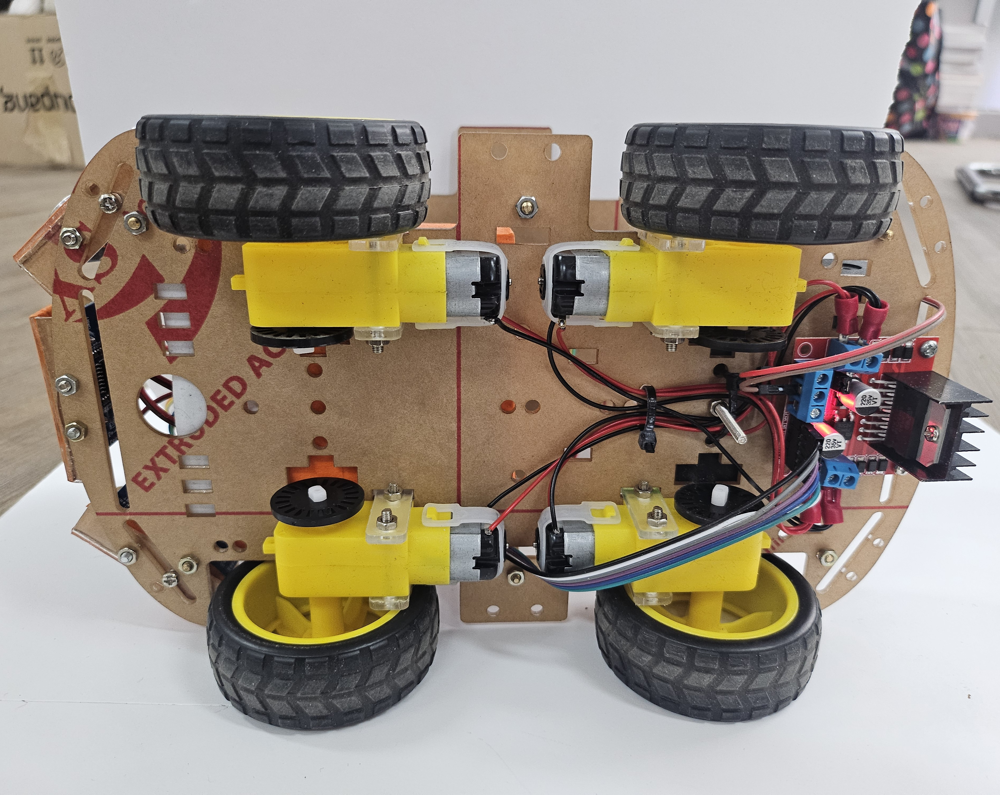

# :car:  Project 3 <span style = "color : #8c04e7"> AutoMobility </span>

## **1. Project Summary (프로젝트 요약)**
STM32(MCU)를 활용하여 블루투스를 통한 수동조종(Manual) 및 자율주행(Auto) 시스템 제작


## 2. Key Features (주요 기능)

### 🕹️ Manual Mode (수동 제어)

- 조이스틱(Joystick)을 통해 차체를 조종가능
- PWM 신호를 통해 자동차의 속도를 변경 가능하고 이를 조이스틱 감도로 제어가능

### 🤖 Auto Mode (자율주행)

- 센서(Ultrasonic) 데이터를 기반으로 장애물 회피
- 데이터를 이중으로 비교하여 회전 중에도 재판단
- 코너에 진입했는데 전면과의 거리가 너무 가까우면 넓은 방향으로 후진

## 🛠 3.  Tech Stack (기술 스택)


### 3.1 Language (사용언어)


### 3.2 Development Environment (개발 환경)
| IDE | Configuration |
| :---: | :---: |
|  |  |
| **STM32CubeIDE** | **STM32CubeMX** |

### 3.3 Collaboration Tools (협업 도구)


## 📂 4.  Project Structure (프로젝트 구조)

### 4.1 Project Tree (프로젝트 트리)

```
Project3_AutoMobility/
├── RC_CAR_R02/                 # [Receiver] RC카 본체 제어부 (STM32F411RETx)
│   ├── Core/
│   │   ├── Src/                # 핵심 주행 및 제어 소스 코드 (.c)
│   │   │   ├── main.c          # 주변장치 초기화 및 메인 제어 루프
│   │   │   ├── car.c           # L298N 모터 드라이버 구동 로직
│   │   │   ├── statemachine.c  # Manual/Auto 모드 전환 상태 머신
│   │   │   ├── ultrasonic.c    # 초음파 센서 거리 측정 및 장애물 판단
│   │   │   ├── direction.c     # 차량 조향 알고리즘 구현
│   │   │   ├── speed.c         # PWM 기반 모터 속도 제어
│   │   │   └── stm32f4xx_it.c  # 타이머/센서 인터럽트 서비스 루틴
│   │   └── Inc/                # 함수 선언 및 하드웨어 설정 헤더 (.h)
│   └── RC_CAR_R02.ioc          # STM32CubeMX 하드웨어 구성 파일
│
├── Remote/                     # [Transmitter] 조이스틱 컨트롤러 (STM32F411CEUx)
│   ├── Core/
│   │   ├── Src/                # 조종기 구동 및 통신 소스 코드 (.c)
│   │   │   ├── main.c          # 컨트롤러 메인 로직
│   │   │   ├── bt_master.c     # 블루투스 마스터 통신 (데이터 송신)
│   │   │   ├── adc.c           # 조이스틱 아날로그 신호 수집
│   │   │   └── dma.c           # 센서 데이터 고속 처리를 위한 DMA 설정
│   │   └── Inc/                # 컨트롤러 헤더 파일 (.h)
│   └── Remote.ioc              # Remote 전용 CubeMX 설정 파일
│
├── images/                     # README 및 기술 문서용 이미지 리소스 (회로도, 다이어그램 등)
└── README.md                   # 프로젝트 전체 가이드 문서
```


### 4.1 Hardware BlockDiagram (하드웨어 블록다이어그램)


### 4.2 State Machine (상태 머신)



## 🏁 5. Final Product & Demonstration (완성품 및 시연)

### 5.1 Final Product (완성품)
<br>

| **전체 샷 (Full Setup)** | **조종기 측면 (Side)** | **조종기 후면 (Back)** |
| :---: | :---: | :---: |
|  |   |  |

<br>

| **차량 전면(Front)** | **차량 측면 (Side)** | **차량 하단 (Bottom)** |
| :---: | :---: | :---: |
|  |  |  |

<br>

### 5.2  Demonstration (시연 영상)

<a href="https://youtube.com/playlist?list=PL6xfXHA4BYR_6b3oBZIrsHkHDf97zLFjA&si=EPpmTzlfJeoMHaCG" target="_blank">
  
</a>

*이미지를 클릭하면 시연 영상(유튜브)로 이동합니다.*


## 6. Troubleshooting (문제 해결 기록)

<details>
<summary> <b>📍 초음파 센서 데이터가 튐 (Outlier) </b></summary>

<br>

🔍  Issue (문제 상황)
자율 주행 모드 주행 중, 전방에 장애물이 없음에도 불구하고 차량이 회피할려고 회전함

❓ Analysis (원인 분석)
STM32 디버깅 툴을 통해 3개의 초음파 센서의 데이터를 검사한 결과 **200cm**가 넘는 값이 

이러한 급격한 데이터 변화가 자율 주행 로직의 판단 임계치를 순간적으로 넘기면서 시스템 오작동을 유발함.

❗ Action (해결 방법)
이동 평균 필터(Moving Average Filter) 적용: ultrasonic.c 소스 파일 내에 최근 측정된 5개의 데이터를 저장하는 버퍼를 생성하고, 해당 데이터들의 평균값을 최종 거리값으로 사용하도록 로직 변경.

급격한 변화율 제한: 이전 측정값과 현재 측정값의 차이가 허용 범위를 초과할 경우, 해당 데이터를 노이즈로 간주하고 무시하는 예외 처리 로직 추가.

✅ Result (결과)
센서 데이터의 변동 폭이 완만해지며 데이터 신뢰도가 크게 향상됨.

불필요한 급제동 현상이 해결되어 부드럽고 안정적인 장애물 회피 주행 기능을 구현함.

</details>
